# 프로젝트명: Space In Dreams

개발자: 최현명

개발년도 2023.09.07~

# [컨셉]

## 메인컨셉 : 궁금증 
- 유저가 게임을 시작하고 정보를 최소한으로 주어 유저로 하여금 궁금증을 유도 하여 게임을 진행할 동기가 되게 합니다.
- 
-  궁금증을 메인컨셉으로 잡은 이유는 제한된 정보를 제공하여 게임이 플레이 되었을때 왜 플레이어가 쫓기고 있는지, 왜 아이템을 수집해야 하는지, 플레이어가 죽으면 왜 다시 처음으로 돌아가는지,  왜 아이템을 모두 수집하면 클리어가 되는지에  대한 궁금증을 얻게 되기 때문에 궁금증이 메인 컨셉이 되었습니다.

### 서브 컨세 1 :공포

- 궁금증의 다른 방향은 알지 못함에 대한 공포 입니다.  정보가 최소화된 상태에서 플레이어를 죽이는 요소가  갑작스럽게 닥치면 플레이어로 하여금 공포를 느끼게 만들 수 있습니다.

플레이어가 공포감을 느낄수 있도록 갑자기 튀어나오는 적,공포스러운bgm등을 넣어 플레이어가 공포감을 느낄 수 있도록 하였습니다.

### 서브 컨세 2 :어려움

- 플레이어가 클리어 하기 어려운 게임으로 제작하여 플레이어가 게임을 클리어 했을 때 희열을 느낄 수 있도록 만드는 것입니다.

- 플레이어가 쉽게 클리어 하지 못하도록 닿으면 죽는 적들을 만들고 적ai에 플레이어에게 최단시간으로 도착하는 적과  도망가는 플레이어에게 갑자기 나타 날 수 있도록 길을 우회하여 도착하는 적으로 변수를 만들어 플레이어가 클리어 하기 어려운 상태로 만들 생각입니다.

### 서브 컨세 3 :방해

- 플레이어를 방해 하는 물건 또는 대상을 만들어 처음에 플레이 하는 유저가 당할 수 있는 요소를 넣어  어려움 컨셉에 도움을 주는 요소가 될 것입니다. 

플레이어가 일정 아이템 개수를 얻으면 맵에 랜덤 아이템들을 몇몇 뿌립니다. 그중 플레이어의 게임 플레이 방해 하는 아이템도 포함 됩니다.  ex)일정 시간내에 일정 갯수의 아이템을 얻지 못하면 다시 시작 ,일정 시간동안 플레이어 움직임 불가, 움직임 느려짐 등등 

### 서브 컨세 4 :재시작

- 플레이어가 죽으면 처음부터 시작하여  플레이어가 클리어 하기 까다롭게 만듭니다. 

플레이어가 죽으면 얻었던 아이템을 모두 잃고 다시 처음부터 시작합니다. 

리스폰 지역을 만들어 플레이어가 죽으면 처음부터 시작 하도록 만듭니다. 

  

# [관련 이미지 & 동영상]

- 이미지  
  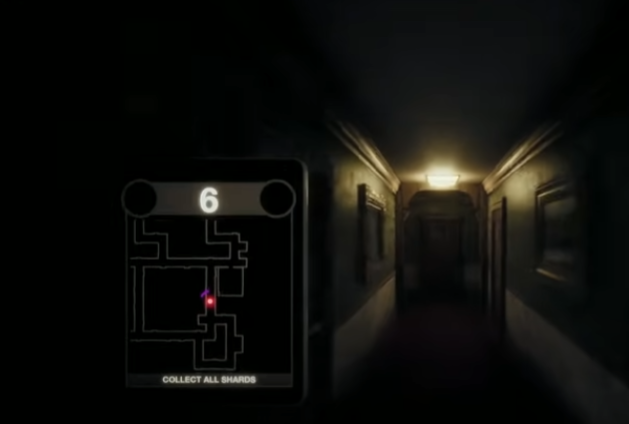
- 동영상
  

  

# [대표 이미지]

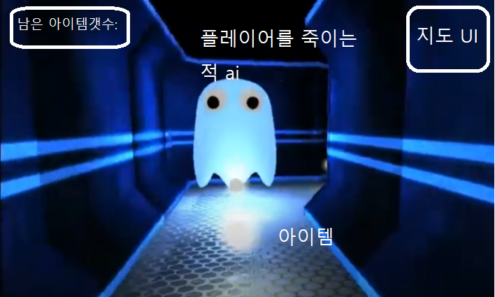

  

# [컨셉 & 대표이미지 기반 작품묘사]

> ### 대표이미지 기반 : 지도에 표시된 아이템을 모두 획득해야 게임이 끝나게 된다. 남은 아이템은 왼쪽 위에 표시가 되고 플레이어를 죽이는 적이 존재 한다. 

> ### 컨셉 기반: 공포스러운 음악이 깔리고 플레이어는 아이템을 먹으며 움직인다.지도는 오른쪽 위에 표시되지만 적은 표시가 되지 않는다. 아이템을 일정 갯수 획득 시 다른 효과의 아이템들이 떨어진다. 

  

# [<게임제목> 구성 요소]

- 우주와 공간이라는 뜻의 space를 이중적으로 생각하여 우주의 배경에서 플레이어가 플레이 하고 결말에서 반전을 주는 요소를 넣어 제목을 space in dreams 라고 지었습니다.

 

## 1. 메커니즘

[도전 과제]

외계인을 피해  일정 아이템을 모두 획득하여 스테이지를 클리어 하여 부품을 모아라

[재미 요소]

1.일정 개수의 아이템을 획득하면 랜덤 아이템들이 맵에 뿌려진다.
2.랜덤 아이템을 획득해 업적을 얻을 수 있다. 
3.랜덤 아이템은 각 방해요소와 이득효과를 얻을 수 있다.
4.난이도 어려운 업적을 클리어 하여 재미를 느낄 수 있다. 

 

## 2. 이야기

[만들게 된 배경]  
공포 게임을 할 때마다 느끼지만 플레이어가 왜 도망쳐야 하고  플레이어가 죽은후 다시 시작할때 왜 리스폰 지역은 같을까? 에 대한 궁금증에 대한 배경이 없던 게임들만 보았고 저는 이에 또다른 스토리를 넣어 플레이어가 게임을 모두 클리어 했을 때 느낄 다양한 요소중 스토리의 반전을 줄 요소로 사용하면 어떨까 싶어 이 게임을 만들게 되었습니다.

[카메라 관점]  
1인칭 시점으로 플레이어가 캐릭터의 시야로 플레이 하게 된다. 플레이어는 자기 자신을 볼 수 없도록한다.

 

## 3. 미적요소

[디자인][컬러]  
[디자인] 검은 배경에 led가 반짝이며 불빛이 캐릭터 아래를 비춘다. 지도와 얻어야 할 아이템 개수만 알 수 있도록 ui를 구성한다.
[컬러] 주로 검은색의 배경에 푸른색이나 노란색 led색상

[음향]  
공포스러운 분위기의 bgm을 깔아 플레이어에게  공포심을 주어 갑자기 나타난 외계인을 보고  놀라게 한다.
 

## 4. 기술

대중적으로 사용되는 pc 사양에 맞게 제작할 예정이다. 

## 5.게임 시스템 디자인 

# 1. 게임 오브젝트 분해 (구성 요소 분석)

|연번|오브젝트 이름|오브젝트 이미지|
|:----:|:----:|:----:|
|001|주인공|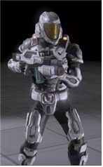|
|002|적1,2,3|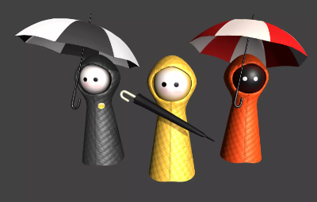|
|003|운전대|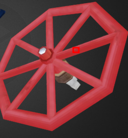|
|004|망치|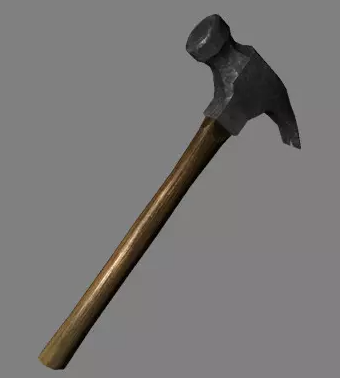|
|005|상자|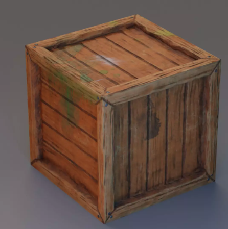|
|006|공포 음악| 이미지 x|
|007|고철더미|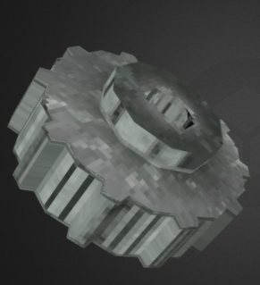|
|008|손전등|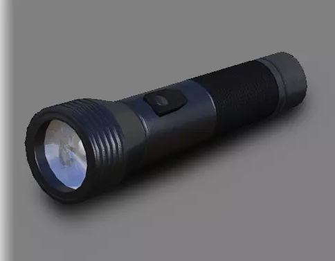|
|009|연장상자|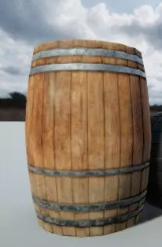|
|010|연료통|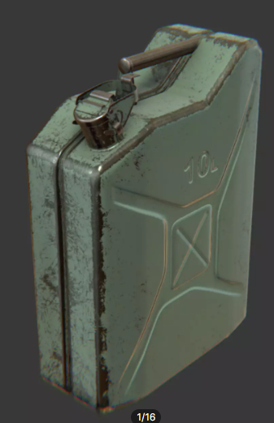|
|011|지도ui|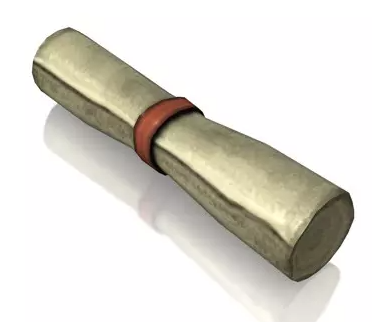|
|012|산소|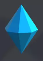|
|013|적일러스트|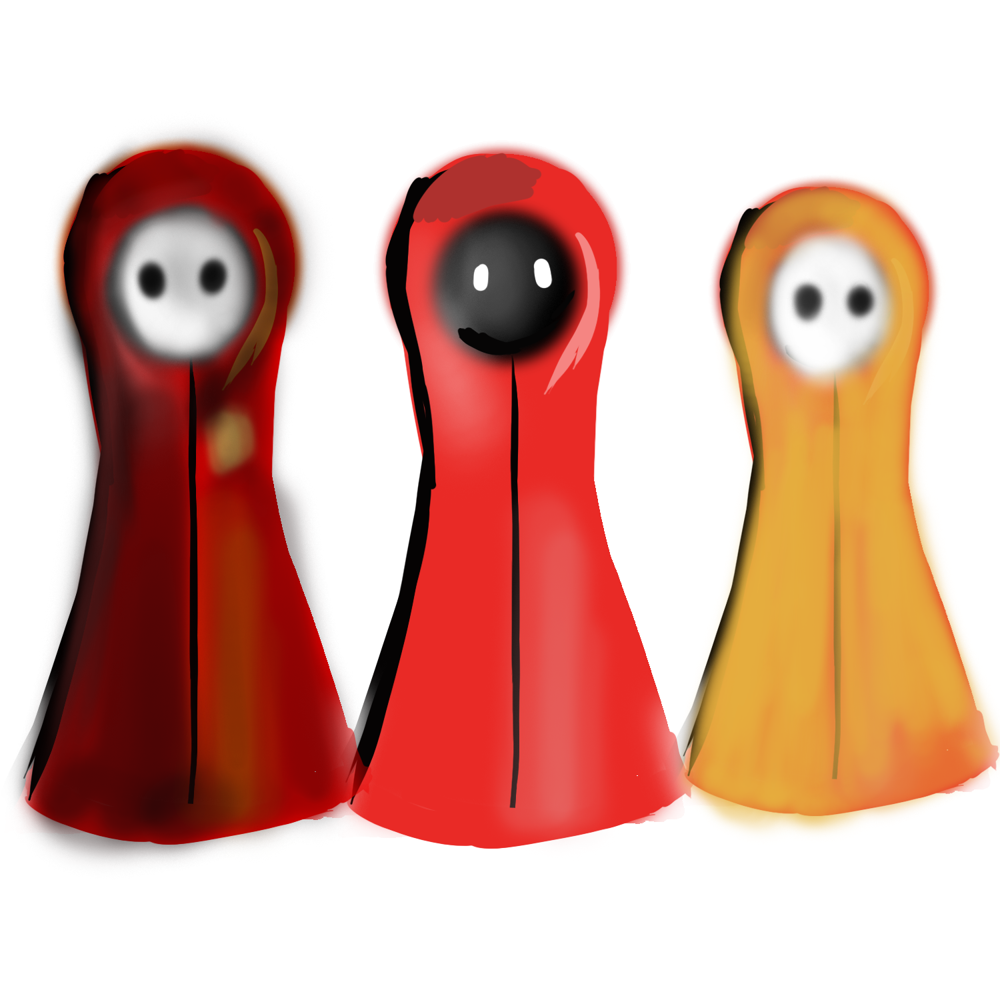|
|014|주인공 일러스트|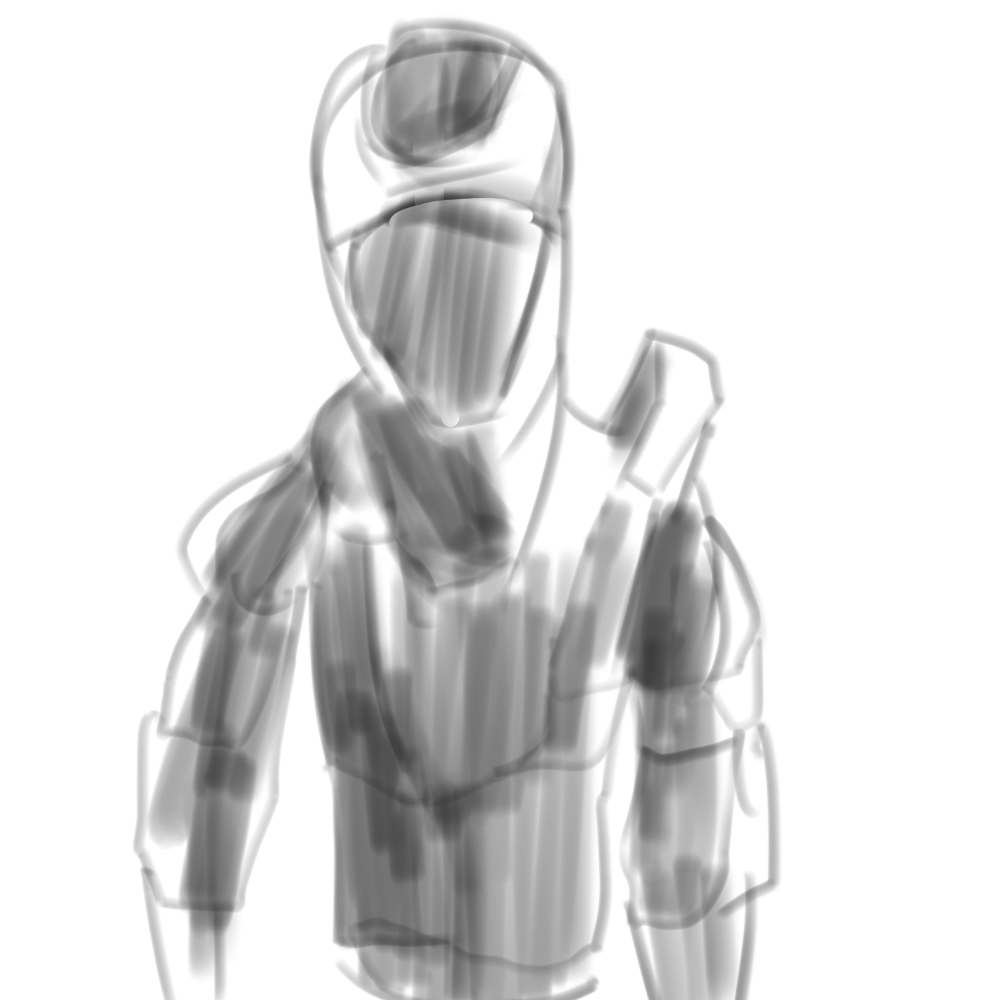|
|015|엔딩 일러스트|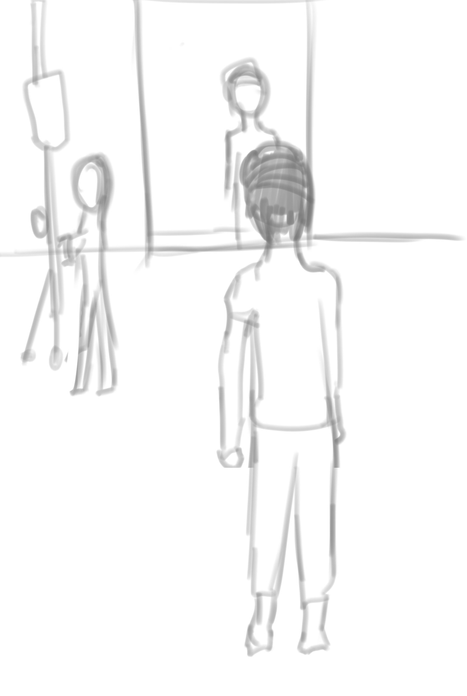|

## 6. 파라미터 뽑기

# 6.1 파라미터(속성) 뽑아 보기

1)  오브젝트 이름: 플레이어
   
   |속성|영문명칭|설명|
   |:---:|:---:|:---:|
   |속도|SPEED|플레이어 속도|
   |상태|status|플레이어 상태|
   |애니|animation|플레이어 캐릭터 애니메이션|
   |이름|name|플레이어 이름|
   |체력|HP|플레이어 체력 디버프 등 다른 요소로 죽음이 될때 사용될 요소|

2) 오브젝트 이름: 적(ai)
   |속성|영문명칭|설명|
   |:---:|:---:|:---:|
   |속도|SPEED|플레이어 속도|
   |상태|status|플레이어 상태|
   |애니메이션|animation|플레이어 캐릭터 애니메이션|
   |이름|name|플레이어 이름|
   |체력|HP|플레이어 체력 디버프 등 다른 요소로 죽음이 될때 사용될 요소|

   
# 6.2 행동 뽑아 보기 
1)  오브젝트 이름: 플레이어
   |행동|영문명칭|설명|
   |:---:|:---:|:---:|
   |일반상태|idle|플레이어가 아무 키도 누르지 않았을때 나타나는 상태 |
   |뛰기|running|플레이어가 이동시 나타나는 상태 |
   |죽음|dead|플레이어가 죽는 상태ㅣ 

3) 오브젝트 이름: 적(ai)
   |행동|영문명칭|설명|
   |:---:|:---:|:---:|
   |일반상태|idle|적이 가만히 있는 상태 |
   |뛰기|running|적이 플레이어를 잡기위해 뛰어다니는 상태 |
   |잡기|hold|적이 플레이어를 잡으면 나타나는 상태 |

# 6.3 상태 뽑아 보기

1) 오브젝트 이름: 플레이어 
2) |현상태|전이상태|전이조건 |
3) |:---:|:---:|:---:|
4) |일반상태|느려짐!|운전대 아이템 획득시 5초간 느려짐 효과 발동 |
5) |일반상태|시야 가리기!|플레이어가 손전등 아이템 획득시 5초간 화면이 검은 상태로 보이고 그동안 무적상태로 있음 |
6) |일반상태|산소부족!|플레이어가 상자 획득시 30초 안에 일정 개수의 산소 획득시 디버프 해제 30초 타임 아웃시 사망 판정 후 리스폰 |
7) |일반상태|정신 분열!|마지막 스테이지에서 15초마다 2초동안 앞뒤 양옆 이동 키가 반대로 적용 |

오브젝트 이름: 적(ai) 
2) |현상태|전이상태|전이조건 |
   |:---:|:---:|:---:|
4) |일반상태|되돌아 가기|플레이어를 리스폰 시킨후에 제자리로 돌아간뒤 다시 플레이어 추격  |
5) |일반상태|추격|플레이어를 사각지대에서 놓친 후에 1초 정도 멈춰서 길을 파악한 뒤 다시 플레이어를 추격합니다. |
6) |일반상태|광폭화!|플레이어가 산소를 일정% 획득하면 5초간 이동속도가 20% 상승한다. |

#6.4 게임의 규칙

1) 핵심 규칙
클리어 조건) 맵에 있는 모든 산소 아이템을 획득하여야 한다. 
플레이어가 이동하면서 모든 산소 획득시 게임 클리어. 플레이어를 잡으러 따라 오는 ai들을 피해 게임을 클리어 하라.
플레이어는 적에게 닿으면 사망 판정 후 아이템을 모두 잃은후 다시 리스폰 된다. 
산소는 지도 ui로 나타나게 되며 남은 산소의 개수는 왼쪽 상단에 표시가 되게된다.
특정 아이템은 플레이어를 사망 판정으로 만들어 플레이어를 리스폰 하게 된다.

2) 보조 규칙
플레이어가 맵에 있는 산소를 일정 개수 획득 시 맵에 아이템이 뿌려진다. 맵에 뿌려진 아이템은 각각의 상태를 변화 시키게 된다.플레이어를 방해하는 아이템은 운전대,손전등,상자 아이템이 있다. 
운전대를 획득하면 플레이어는 5초간 느려지게 된다. 손전등을 획득하면 5초간 화면이 검은화면이 되고 플레이어는 무적상태가 된다.(적 ai는 그동안 플레이어를 추적 할 수 있으므로 무적이라고 방심 하면 안된다.) 
상자 아이템을 획득하면 디버프가 발생 하는데 30초 동안 남은 산소의 일정 %만큼 획득 하지 못하면 플레이어를 사망 상태로 만들어 아이템을 모두 잃고 리스폰 하게 된다. 

마지막 스테이지는 기본적인 플레이어를 방해하는 요소가 존재한다. 플레이어는 15초마다 2초동안 앞뒤좌우 버튼이 반대로 바뀌게 된다. 

#6.5 게임에서 사용될 공식

ai가 플레이어를 추격중 사각지대에서는 다시 탐색하므로 일부로 ai들을 끌어들여 사각지대로 유인한뒤 
ai가 재탐색 해야 하도록 유도하여 도망치면서 아이템을 얻도록 한다. 

손전등 아이템의 무적 시간을 이용해 대부분 아이템을 획득 하였을 때 일부러 손전등 아이템을 먹고 지도만 보면서 움직여 5초간 무적으로 안정적으로 게임 클리어를 할 수 있다.

##7 개발 요구사항 & 흐름도

#7.1 요구사항

1.게임 시작시 보이는 화면 play버튼 업적, 환경설정 종료 버튼 제작.
2.play 버튼을 누르면 스테이지 5개를 선택 할 수 있는 창이 뜨도록 제작.
3.스테이지는 이전 스테이지 클리어시 잠금 해제되도록 한다.
4.스테이지 입장시 가장 오른쪽 위에 맵ui를 볼 수 있는 지도 ui를 배치 한다.
5. 왼쪽 위에 남은 얻어야 할 산소 양이 있다. 산소 아이템 획득시 차감 산소 모두 획득시 스테이지 클리어.
6.이동은 wasd키를 이용해 이동한다. 시점은 마우스를 돌려 이동 하도록 제작한다.
7.스테이지 마다  플레이어 리스폰 지역 start point를 설정 한다. 
8.적은 랜덤 리스폰을 위해 랜덤 리스폰 point 설정 한다.
9.적 이동속도는 플레이어의 80%로 설정한다.
10.플레이어는 적 오브젝트와 닿으면 애니메이션,음악 플레이 후 처음부터 다시 시작된다.
11.산소 아이템이 전체 개수의 60%이상 획득된 상태이면 랜덤 아이템을 뿌리도록 한다.
12.적이 플레이어와 닿을 시 나오는 애니메이션 제작.
13.플레이 맵 제작(5개).
14.플레이어는 1인칭 카메라로 한다.
15.적이 근처에 접근 시 배경 음악 대신 적 음악 플레이.
16.맵에 산소는 맵당 120~ 180개 사이로 제작.
17.마지막 스테이지는 15초마다 2초동안 키입력이 반대로 입력되도록 한다.
18.플레이어가 랜덤 아이템을 획득하면 바로 효과가 발동 된다. 
19.효과는 느려짐!.시야 가리기!,산소 부족! 디버프이다.
20. 플레이어가 산소 부족! 상태면 1초마다 3의 체력이 깎이게 된다. 체력이0이 되면 플레이어는 리스폰된다.
21.게임 플레이 중 esc 버튼을 누르면 게임이 잠시 멈추고 환경설정,게임 종료 업적 등을 확인 할 수 있는 창이 있다.
22.플레이어는 플레이 중 업적을 달성 할 수 있다. 업적은 여러 가지 종류가 있고 업적 획득 시 업적 이미지등을 획득 할 수 있다. 
23.업적 종류에는 산소부족!인 상태로 체력0으로  죽음. 노데미지 클리어, 리스폰0인 상태로 클리어,~~분 이내 클리어, 맵의 모든 아이템 획득 등이 있다.
24.업적용 변수들 리스폰 횟수,클리어 시간, 체력등이 있다.
25.모든 디버프는 플레이어에게 지속시간동안 화면에 변화가 있다. 
26.플레이어가 특정 상황에 죽고 리스폰 되거나 여러번 죽은 후에 리스폰 시 의미 심장한 대사를 한다.
27.스테이지는 어두운 우주 배경으로 한다. 
28.기본 배경음악은 긴장감을 올려줄 호러 음악이다.
29.적이 근처에 올 때 나타날 음악 필요.
30.적이 플레이어 처치시 나타날 애니메이션 구현 필요.

#7.2 시간별 흐름도 Flow chart

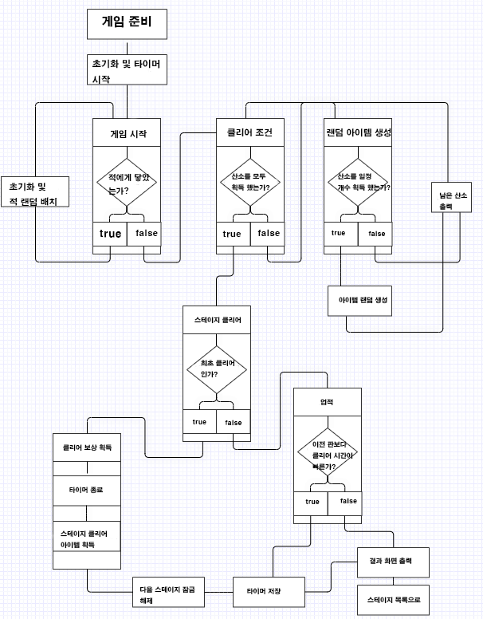

#7.3 키보드 이벤트에 대한 흐름도

#7.4 용어 정리

##8 스토리보드

